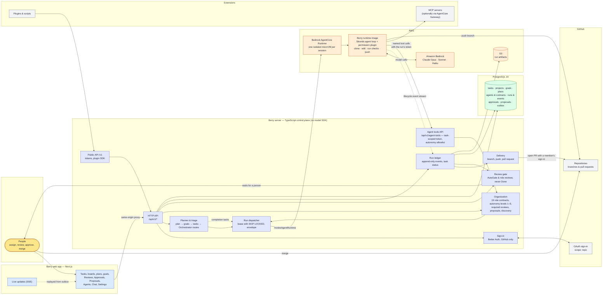
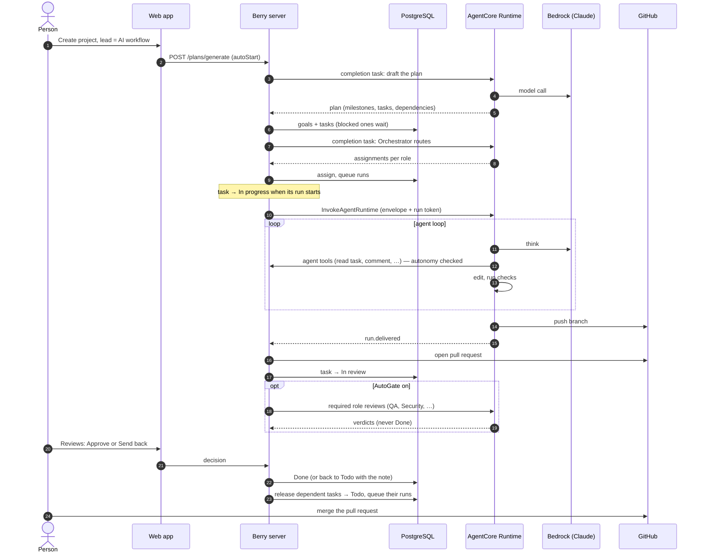

# Berry architecture

Berry is a control plane: it decides what work happens, records everything, and keeps a person at the release decision. Something separate, the agent runtime on AWS, does the work.

## System overview

## Life of a task

## Reading the diagram

- **The server never calls a model.** Every model call happens inside the runtime image on AWS. A repository check fails if a model SDK is imported by the server.
- **One narrow door for agents.** An agent reaches Berry only through the agent tools API, with a token minted for its run. The token names the workspace and the task; the model can't choose them. Each tool call is checked against the agent's autonomy level.
- **A person releases the work.** No agent tool can set *Done* or *Cancelled*, no autonomy level includes a merge tool, and a reviewer agent's approval leaves the task in review.
- **Everything is a record.** Runs are append-only event logs, task changes write outbox events in the same transaction, and live pages replay from that table.
